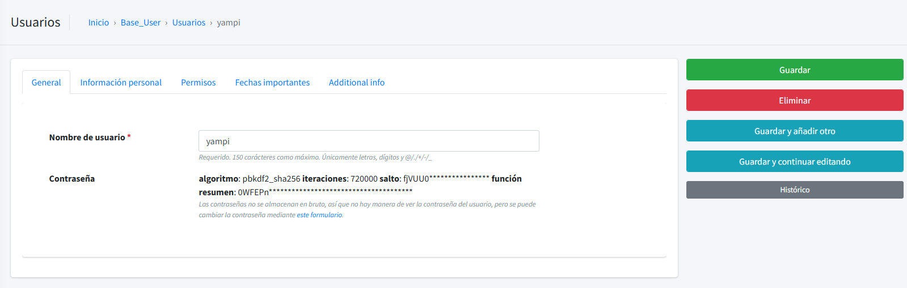
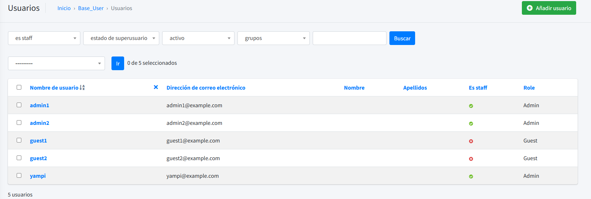
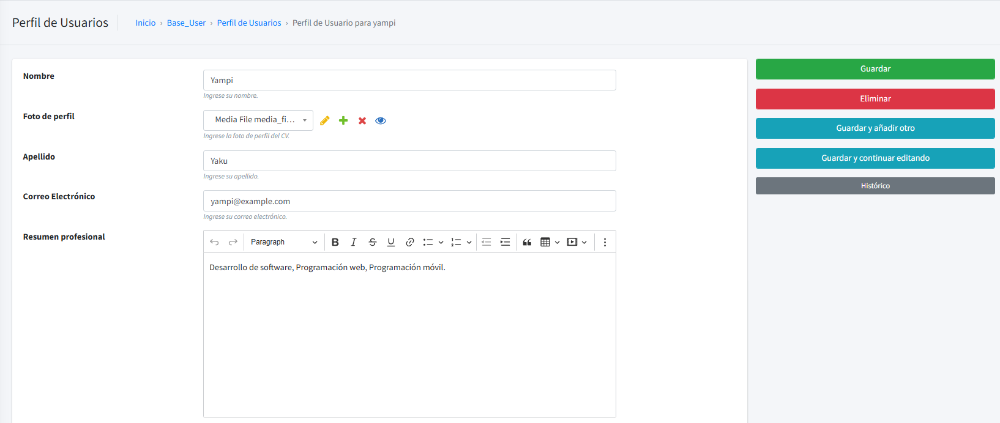
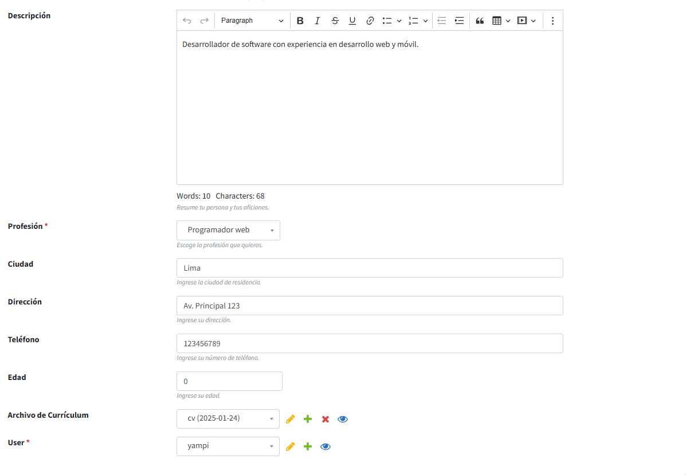
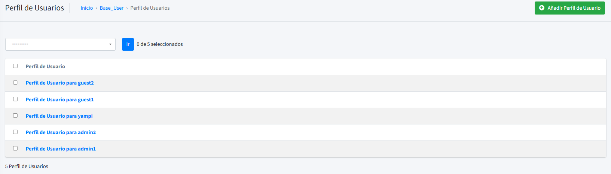
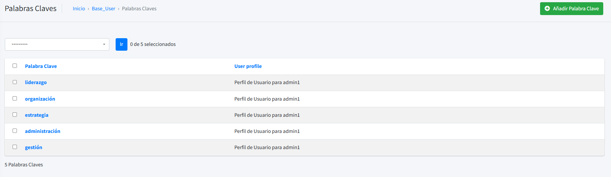

# CV Backend - Proyecto Django - Docs - Base User

Explicación de la aplicación `Base User` del proyecto CV Backend.

---

## Tabla de Contenidos

1. [Introducción](#introducción)
2. [Descripción General](#descripción-general)
3. [Documentación del Modelo `CustomUser`](#documentación-del-modelo-customuser)
4. [Documentación del Modelo `UserProfile`](#documentación-del-modelo-userprofile)
5. [Documentación del Modelo `Keywords`](#documentación-del-modelo-keywords)
6. [Documentación del Modelo `Meta`](#documentación-del-modelo-meta)
7. [Apis](#apis)
8. [Administrador de Django](#administrador-de-django)

---

## Introducción

La aplicación `base_user` es la encargada de gestionar los usuarios del sistema. Proporciona un modelo base `User` que se puede extender para agregar campos adicionales y funcionalidades específicas. Además esta hereada de `AbstractBaseUser`. Se ha adaptado para poder servir datos de usuarios registrados en formato JSON.

---

## Descripción General

La aplicación `base_user` se ha pensado que se encargue de la gestión de los usuarios, aunque no se descarta del todo utilizar el `django-guardian` para la gestión de permisos. **Importante: todavía no se ha integrado del todo los permisos en los signals ni en los ficheros de administración para servir datos de forma individual**

---

## Documentación del Modelo `CustomUser`

El modelo `CustomUser` extiende el modelo `AbstractUser` de Django para personalizar los usuarios en el proyecto, añadiendo campos específicos como `role` y `profile_image`.

### Descripción General

- **Nombre del Modelo**: `CustomUser`
- **Base**: Hereda de `AbstractUser`.
- **Propósito**: Proveer un sistema de usuarios personalizado con roles y fotos de perfil.

### Campos

| Campo               | Tipo         | Descripción                                                                                              |
| ------------------- | ------------ | -------------------------------------------------------------------------------------------------------- |
| **`role`**          | `CharField`  | Define el rol del usuario. Las opciones son: `admin`, `guest` y `test`. Valor por defecto: `guest`.      |
| **`profile_image`** | `ForeignKey` | Referencia opcional a un archivo multimedia (`MediaFile`) para establecer la foto de perfil del usuario. |

### Meta

| Propiedad       | Valor               |
| --------------- | ------------------- |
| **`swappable`** | `'AUTH_USER_MODEL'` |

### Roles Disponibles

| Valor   | Descripción             |
| ------- | ----------------------- |
| `admin` | Administrador           |
| `guest` | Invitado (por defecto). |
| `test`  | Usuario de pruebas.     |

### Métodos

#### **`__str__(self)`**

- Representación en cadena del modelo.
- Retorna: El nombre de usuario (`self.username`).

### Características Adicionales

- **Roles Personalizados**: Permite asignar roles específicos a los usuarios para gestionar permisos y funcionalidades.
- **Foto de Perfil**: Permite asociar una imagen como foto de perfil usando el modelo `MediaFile`.
- **Compatibilidad con `AbstractUser`**: Hereda toda la funcionalidad del modelo base de Django, incluyendo autenticación, permisos y campos predeterminados como `username`, `email`, `password`, etc.

---

## Documentación del Modelo `UserProfile`

El modelo `UserProfile` representa la información personal y profesional de un usuario, incluyendo datos como nombre, foto de perfil, resumen profesional, y currículum.

### Descripción General

- **Nombre del Modelo**: `UserProfile`
- **Propósito**: Almacenar información detallada de los usuarios, incluyendo datos personales y profesionales.

### Campos

| Campo                     | Tipo             | Descripción                                                                                                        |
| ------------------------- | ---------------- | ------------------------------------------------------------------------------------------------------------------ |
| **`nombre`**              | `CharField`      | Nombre del usuario. Opcional.                                                                                      |
| **`foto`**                | `ForeignKey`     | Referencia a un archivo multimedia (`MediaFile`) que sirve como foto de perfil del usuario.                        |
| **`apellido`**            | `CharField`      | Apellido del usuario. Opcional.                                                                                    |
| **`correo_electronico`**  | `EmailField`     | Correo electrónico único del usuario.                                                                              |
| **`resumen_habilidades`** | `CKEditor5Field` | Resumen profesional breve del usuario. Opcional.                                                                   |
| **`description`**         | `CKEditor5Field` | Descripción personal y aficiones del usuario. Opcional.                                                            |
| **`profesion`**           | `CharField`      | Profesión del usuario. Opciones disponibles: `Programador Web`, `Administrador de Sistemas`, `Programador Mobile`. |
| **`ciudad`**              | `CharField`      | Ciudad de residencia del usuario. Opcional.                                                                        |
| **`direccion`**           | `CharField`      | Dirección de residencia del usuario. Opcional.                                                                     |
| **`telefono`**            | `CharField`      | Número de teléfono del usuario. Opcional.                                                                          |
| **`edad`**                | `IntegerField`   | Edad del usuario. Opcional.                                                                                        |
| **`resume_file`**         | `ForeignKey`     | Referencia a un archivo de currículum (`DocumentFile`). Opcional.                                                  |
| **`user`**                | `OneToOneField`  | Relación uno a uno con el modelo de usuario (`AUTH_USER_MODEL`).                                                   |

### Meta

| Propiedad                 | Valor                |
| ------------------------- | -------------------- |
| **`verbose_name`**        | "Perfil de Usuario"  |
| **`verbose_name_plural`** | "Perfil de Usuarios" |

---

### Métodos y Propiedades

#### **`profesion_readable`**

- **Tipo**: Propiedad.
- **Descripción**: Devuelve una representación legible de la profesión del usuario.

#### **`load(cls)`**

- **Tipo**: Método de clase.
- **Descripción**: Recupera o crea una instancia de `UserProfile` con `pk=1`.

#### **`__str__(self)`**

- **Descripción**: Representación en cadena del modelo.
- **Retorno**: `"Perfil de Usuario para <nombre_de_usuario>"`.

### Características Adicionales

- **Gestión de Profesiones**: Permite seleccionar entre varias profesiones predefinidas.
- **Relación con Archivos**: Asocia fotos de perfil y currículums almacenados en los modelos `MediaFile` y `DocumentFile`.
- **Personalización Extensible**: Incluye campos para datos como ciudad, dirección, teléfono y descripción personal.

---

## Documentación del Modelo `Keywords`

El modelo `Keywords` representa palabras clave asociadas al perfil de un usuario para optimizar el SEO (Search Engine Optimization).

### Descripción General

- **Nombre del Modelo**: `Keywords`
- **Propósito**: Almacenar palabras clave asociadas a un perfil de usuario para mejorar la optimización en motores de búsqueda.

### Campos

| Campo              | Tipo         | Descripción                                                                                      |
| ------------------ | ------------ | ------------------------------------------------------------------------------------------------ |
| **`user_profile`** | `ForeignKey` | Relación con el modelo `UserProfile`. Indica a qué perfil de usuario pertenece la palabra clave. |
| **`keyword`**      | `CharField`  | Palabra clave para el SEO. Longitud máxima de 100 caracteres.                                    |

### Meta

| Propiedad                 | Valor             |
| ------------------------- | ----------------- |
| **`verbose_name`**        | "Palabra Clave"   |
| **`verbose_name_plural`** | "Palabras Claves" |

### Métodos

#### **`__str__(self)`**

- **Descripción**: Representación en cadena del modelo.
- **Retorno**: `"<keyword> (Perfil de <user_profile>)"`.

### Características Adicionales

- **Optimización para SEO**: Permite asociar múltiples palabras clave a cada perfil de usuario para mejorar su visibilidad en búsquedas.
- **Relación con Perfiles**: Cada palabra clave está vinculada directamente a un perfil de usuario (`UserProfile`).

---

## Documentación del Modelo `Meta`

El modelo `Meta` representa información auxiliar para optimizar el SEO de un sitio web, asociando metadatos a un perfil de usuario.

### Descripción General

- **Nombre del Modelo**: `Meta`
- **Propósito**: Almacenar información meta como título, descripción, y elementos visuales (íconos) para mejorar el SEO de las páginas asociadas a un usuario.

### Campos

| Campo                  | Tipo             | Descripción                                                                                              |
| ---------------------- | ---------------- | -------------------------------------------------------------------------------------------------------- |
| **`user_profile`**     | `OneToOneField`  | Relación uno a uno con el modelo `UserProfile`. Indica a qué perfil de usuario pertenecen los metadatos. |
| **`meta_title`**       | `CharField`      | Título meta utilizado para SEO. Longitud máxima de 255 caracteres.                                       |
| **`meta_description`** | `CKEditor5Field` | Descripción meta. Campo opcional con soporte para texto enriquecido.                                     |
| **`page_icon`**        | `ForeignKey`     | Referencia opcional a un archivo multimedia (`MediaFile`) que sirve como ícono de la página.             |
| **`favicon`**          | `ForeignKey`     | Referencia opcional a un archivo multimedia (`MediaFile`) que sirve como favicon de la página.           |

### Meta

| Propiedad                 | Valor        |
| ------------------------- | ------------ |
| **`verbose_name`**        | "Meta Datos" |
| **`verbose_name_plural`** | "Meta Datos" |

### Métodos

#### **`__str__(self)`**

- **Descripción**: Representación en cadena del modelo.
- **Retorno**: `"Meta Datos de <user_profile>"`.

### Características Adicionales

- **Optimización para SEO**: Permite almacenar y gestionar información clave para mejorar la visibilidad en motores de búsqueda.
- **Soporte para íconos visuales**: Incluye campos para asociar íconos personalizados (`page_icon` y `favicon`) con la página del usuario.
- **Relación Directa con Perfiles**: Cada conjunto de metadatos está vinculado exclusivamente a un perfil de usuario.

---

## Administrador de Django

En el administrador de Django se han personalizado los modelos `CustomUser`, `UserProfile`, `Keywords` y `Meta` para facilitar la gestión de los usuarios y sus perfiles. Se han añadido filtros, campos de búsqueda y acciones personalizadas para mejorar la experiencia del administrador.
Además que se generará una respuesta en formato JSON con los datos de los usuarios registrados en el sistema.

### Personalización del Administrador

1. **Custom User**: Visualización de usuarios con roles y fotos de perfil. **Importante: Hay dos imágenes, una para el administrador de Django y otra para el perfil**
   1.1 Imagen del administrador de Django
   
   1.2 Imagen del administrador de Django de todos los usuarios
   
2. **User Profile**: Visualización de perfiles de usuario con información personal y profesional.
   2.1 Imagen del administrador de Django de un perfil de usuario **importante: Se ha añadido la funcionalidad para que el mismo usuario vinculado pueda modificar sus datos y ver sus datos privados**
   
   
   
   2.2 Imagen del administrador de Django de todos los perfiles de usuario **importante: No se puede ni crear ni eliminar los perfiles de usuario. Es necesario crear un Custom User para que este mediante un signal cree el perfil**
   
3. **Keywords**: Visualización de palabras clave asociadas a perfiles de usuario.
   3.1 Imagen del administrador de Django de las palabras clave
   

## Apis

La aplicación `base_user` cuenta con las siguientes apis:

1.  **`/base/userprofile/`**: Permite listar todos perfiles de los usuarios registrados en el sistema.

    ```json
    [
        {DATAUSER_1},
        {DATAUSER_2},
        {DATAUSER_3},
    ]
    ```

2.  **`/base/userprofile/<int:pk>/`**: Permite obtener un perfil de usuario específico.

```json
{
  "id": 79,
  "foto": {
    "file": "http://127.0.0.1:8000/media/media_files/bandera_de_espanya_multicural_SVFnMBw.png",
    "title": "logo",
    "uploaded_at": "2025-01-27T08:32:49.941577+01:00",
    "image_for_pc_url": "http://localhost:8000/media/CACHE/images/media_files/bandera_de_espanya_multicural_SVFnMBw/8f5c7a01564fc0da9ddfe67c8c3491ec.jpg",
    "image_for_tablet_url": "http://localhost:8000/media/CACHE/images/media_files/bandera_de_espanya_multicural_SVFnMBw/a817c9ee75a7e353581bb93818412731.jpg",
    "image_for_mobile_url": "http://localhost:8000/media/CACHE/images/media_files/bandera_de_espanya_multicural_SVFnMBw/c1db01cdff074d58c738953f6195dc36.jpg"
  },
  "resume_file": {
    "title": "CV de juan",
    "file": "http://127.0.0.1:8000/media/documents/cv_Oox0iKS.pdf",
    "pdf_url": "http://localhost:8000/media/documents/cv_Oox0iKS.pdf"
  },
  "profesion": "Administrador de sistemas",
  "meta": {
    "id": 6,
    "page_icon": {
      "file": "/media/media_files/workflow.png",
      "title": "logo",
      "uploaded_at": "2025-01-27T08:32:14.716716+01:00",
      "image_for_pc_url": "http://localhost:8000/media/CACHE/images/media_files/workflow/e2ba8195a0208097d7916db46f0ecbaf.jpg",
      "image_for_tablet_url": "http://localhost:8000/media/CACHE/images/media_files/workflow/287a2f10c67c69d86a1f5c0285c61cac.jpg",
      "image_for_mobile_url": "http://localhost:8000/media/CACHE/images/media_files/workflow/44c9191b221ffae878f42812cae5f9ae.jpg"
    },
    "favicon": {
      "file": "/media/media_files/cafe_VqTy4cq.png",
      "title": "favicon",
      "uploaded_at": "2025-01-27T08:32:26.440425+01:00",
      "image_for_pc_url": "http://localhost:8000/media/CACHE/images/media_files/cafe_VqTy4cq/0e7f9a8925306f731160f1a50a6bf37e.jpg",
      "image_for_tablet_url": "http://localhost:8000/media/CACHE/images/media_files/cafe_VqTy4cq/2e9c133763848edde80c949f26d33f2d.jpg",
      "image_for_mobile_url": "http://localhost:8000/media/CACHE/images/media_files/cafe_VqTy4cq/26c5393057cb58be71e777b8dd45877a.jpg"
    },
    "meta_title": "curriculum de Juan",
    "meta_description": "<p>Curriculum de Juan Pérez</p>",
    "meta_color": "#FF8E8E",
    "user_profile": 79
  },
  "keywords": [
    {
      "id": 36,
      "keyword": "gestión",
      "user_profile": 79
    },
    {
      "id": 37,
      "keyword": "administración",
      "user_profile": 79
    },
    {
      "id": 38,
      "keyword": "estrategia",
      "user_profile": 79
    },
    {
      "id": 39,
      "keyword": "organización",
      "user_profile": 79
    },
    {
      "id": 40,
      "keyword": "liderazgo",
      "user_profile": 79
    }
  ],
  "nombre": "Juan",
  "apellido": "Pérez",
  "correo_electronico": "admin1@example.com",
  "resumen_habilidades": "<p>Liderazgo, Gestión de equipos, Estrategia.</p>",
  "description": "<p>Administrador con amplia experiencia en proyectos tecnológicos.</p>",
  "ciudad": "Galicia",
  "direccion": "Av. Principal 123",
  "telefono": "123456789",
  "edad": 45,
  "user": 79
}
```

## Administrador de Django

    Se ha integrado filtros y se ha modificado el administrador para que funcione de forma individual con los usuarios registrados en el sistema.**importante: Solo el superusuario puede ver los datos de los usuarios registrados en el sistema. Pero no puede editar los datos de los usuarios registrados**

    1. **UserProfileAdmin**:
        1.1 Filtra las imagenes y los documentos de forma individual. Así como los metadatos y las palabras clave. Con esto se respeta la privacidad de los usuarios registrados en el sistema.
        1.2 Se ha añadido la funcionalidad para que el mismo usuario registrado pueda modificar sus datos y ver sus datos privados.
    2. **KeywordsAdmin**:
        2.1 Filtra las palabras clave de forma individual. Así como los metadatos y las imagenes. Con esto se respeta la privacidad de los usuarios registrados en el sistema.
    3. **MetaAdmin**:
        3.1 Filtra los metadatos de forma individual. Así como las palabras clave y las imagenes. Con esto se respeta la privacidad de los usuarios registrados en el sistema.
