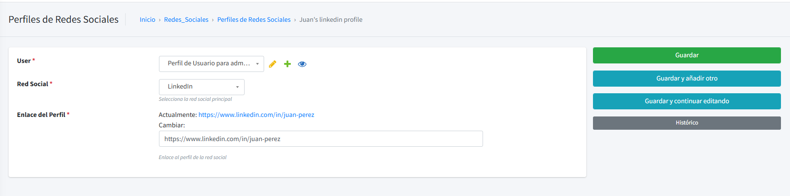
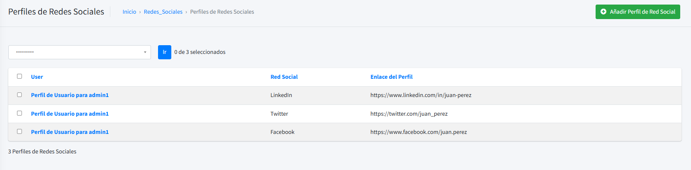

# CV Backend - Proyecto Django - Docs - Base User

Explicación de la aplicación `redes sociales` del proyecto CV Backend.

---

## Tabla de Contenidos

1. [Introducción](#introducción)
2. [Descripción general](#descripción-general)
3. [Documentación del Modelo `SocialMediaProfile`](#documentación-del-modelo-socialmediaprofile)
4. [Administración de Django](#administración-de-django)
5. [API](#api)

---

## Introducción

La aplicación `redes_sociales` es una aplicación que permite gestionar las redes sociales de un usuario. En ella se pueden crear, modificar y eliminar redes sociales de un usuario, limitado a las redes sociales que se encuentran en la base de datos.

---

## Descripción general

La aplicación de `redes_sociales` esta pensada para que un usuario pueda añadir sus redes sociales con enlaces y tipo de red social limitado por el superusuario.

---

# Documentación del Modelo `SocialMediaProfile`

El modelo `SocialMediaProfile` se utiliza para gestionar los perfiles de redes sociales asociados a los usuarios del sistema.

### Descripción General

- **Nombre del Modelo**: `SocialMediaProfile`
- **Propósito**: Almacenar y gestionar información sobre los perfiles de redes sociales vinculados a cada usuario.

### Campos

| Campo              | Tipo         | Descripción                                                                                                               |
| ------------------ | ------------ | ------------------------------------------------------------------------------------------------------------------------- |
| **`user`**         | `ForeignKey` | Relación con el modelo `UserProfile`. Indica a qué perfil de usuario pertenece el perfil de red social.                   |
| **`social_media`** | `CharField`  | Tipo de red social. Opciones disponibles incluyen `Facebook`, `Twitter`, `Instagram`, etc. Valor por defecto: `Facebook`. |
| **`profile_link`** | `URLField`   | Enlace al perfil de la red social del usuario.                                                                            |

### Meta

| Propiedad                 | Valor                        |
| ------------------------- | ---------------------------- |
| **`verbose_name`**        | "Perfil de Red Social"       |
| **`verbose_name_plural`** | "Perfiles de Redes Sociales" |

### Opciones para Redes Sociales

| Valor            | Descripción    |
| ---------------- | -------------- |
| `facebook`       | Facebook       |
| `twitter`        | Twitter        |
| `instagram`      | Instagram      |
| `linkedin`       | LinkedIn       |
| `youtube`        | YouTube        |
| `github`         | GitHub         |
| `stack_overflow` | Stack Overflow |
| `dev_to`         | Dev.to         |

### Métodos y Propiedades

#### **`red_social_readable`**

- **Tipo**: Propiedad.
- **Descripción**: Devuelve una representación legible del tipo de red social.

#### **`__str__(self)`**

- **Descripción**: Representación en cadena del modelo.
- **Retorno**: `"<nombre_del_usuario>'s <red_social> profile"`.

### Características Adicionales

- **Gestión de Redes Sociales**: Permite asociar múltiples perfiles de redes sociales a cada usuario.
- **Opciones Extensibles**: Se pueden agregar nuevas redes sociales fácilmente al campo `SOCIAL_MEDIA_CHOICES`.

---

## Administración de Django

La aplicación `redes_sociales` incluye un modelo de administración personalizado para el modelo `SocialMediaProfile`.

### Personalización del Administrador

1. **Listado de Campos**: Muestra los campos `user`, `social_media` y `profile_link`.
   
2. **Listado por Usuario**: Permite a los usuarios solo ver sus propias redes sociales, solo el superuser puede ver todo.
   

---

## Apis

La aplicación `redes_sociales` incluye una API para gestionar los perfiles de redes sociales de los usuarios pero esta esta viculada a la aplicación de `base_user`.

1. **Listado de Campos**: Muestra los campos `user`, `social_media` y `profile_link`.
   ```json
    "socials_media": [
        {
            "social_media": "facebook",
            "profile_link": "https://www.facebook.com/juan.perez"
        },
        {
            "social_media": "twitter",
            "profile_link": "https://twitter.com/juan_perez"
        },
        {
            "social_media": "linkedin",
            "profile_link": "https://www.linkedin.com/in/juan-perez"
        }
    ]
   ```
